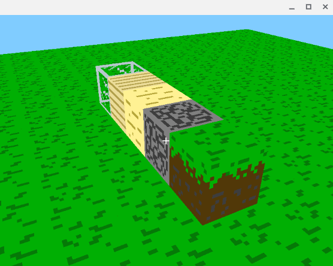

# Minecraft
simple minecraft made with C++ and OpenGL made in one long file

## Controls
**WASD** = movement
**shift** = down
**space** = up
**enter** = wireframe
**escape** = show cursor
**backspace** = quit/exit

*number keys cycle through blocks*
1. dirt
2. cobblestone
3. sand
4. wood planks
5. glass


```bash
g++ main.cpp -o main -lglfw -lGLEW -lGL -ldl -lGLU && ./main
```




